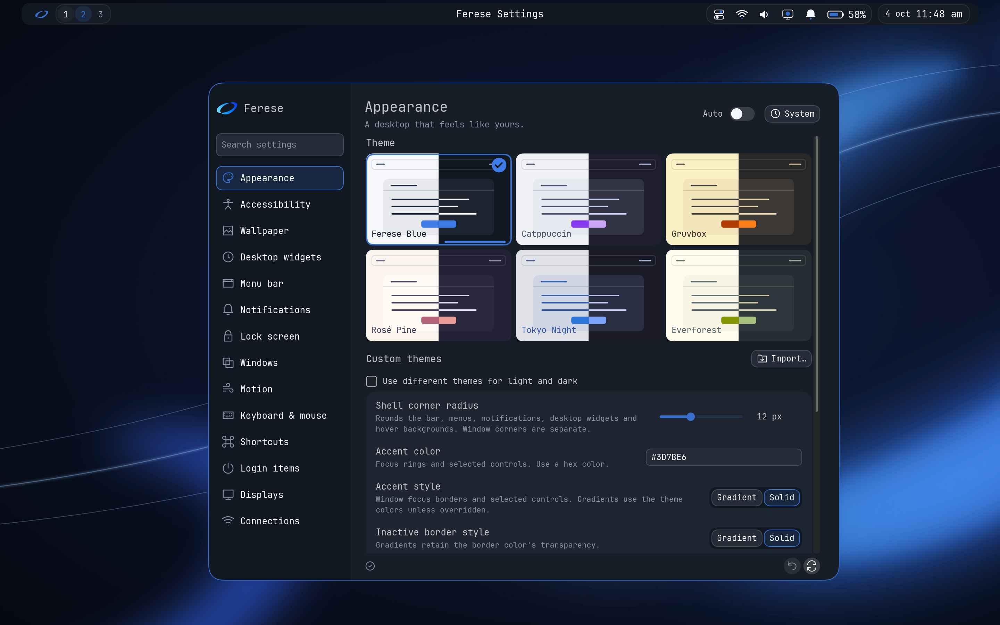
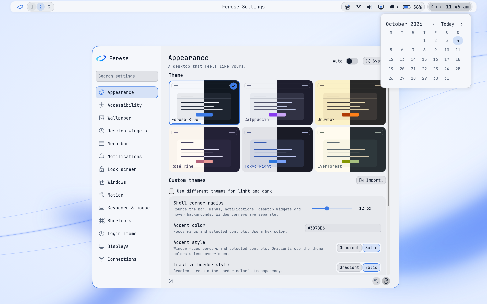
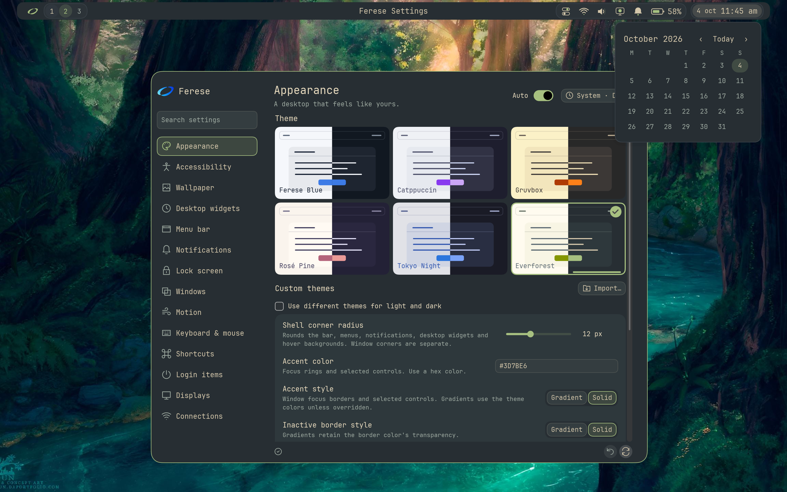
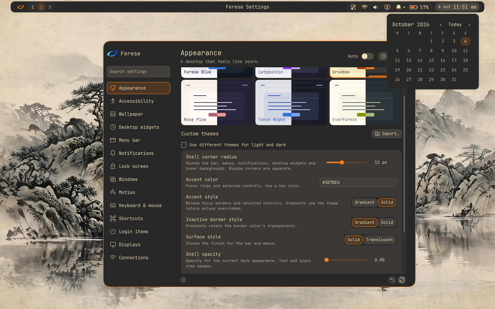
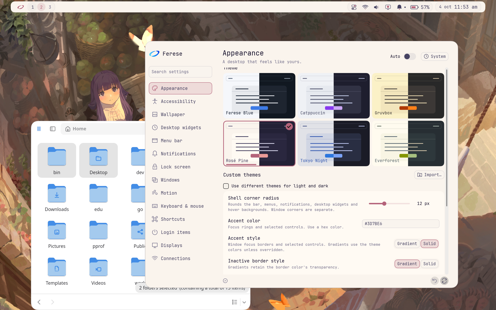

# Screenshots

Click an image to open it at full size.

## Ferese Blue dark

Appearance settings with the default dark wallpaper.

## Ferese Blue light

Appearance settings and the calendar with the default light wallpaper.

## Workspace overview

Terminal and Settings windows, with previews of three workspaces.

## Everforest

Appearance settings and the calendar over a custom forest wallpaper.

## Gruvbox

Appearance settings and the calendar over a custom landscape wallpaper.

## Rosé Pine dark

Theme previews, Control Center and a file manager.

## Rosé Pine light

Appearance settings and a file manager over the same custom wallpaper.

