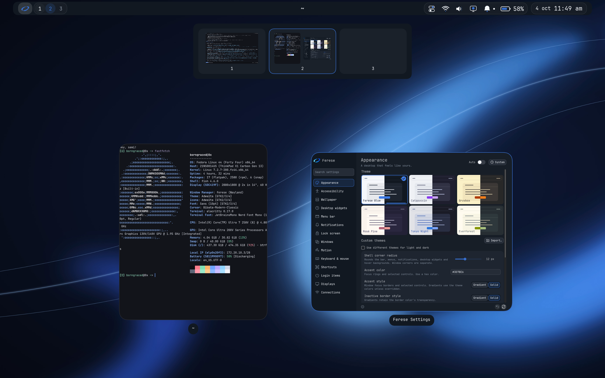
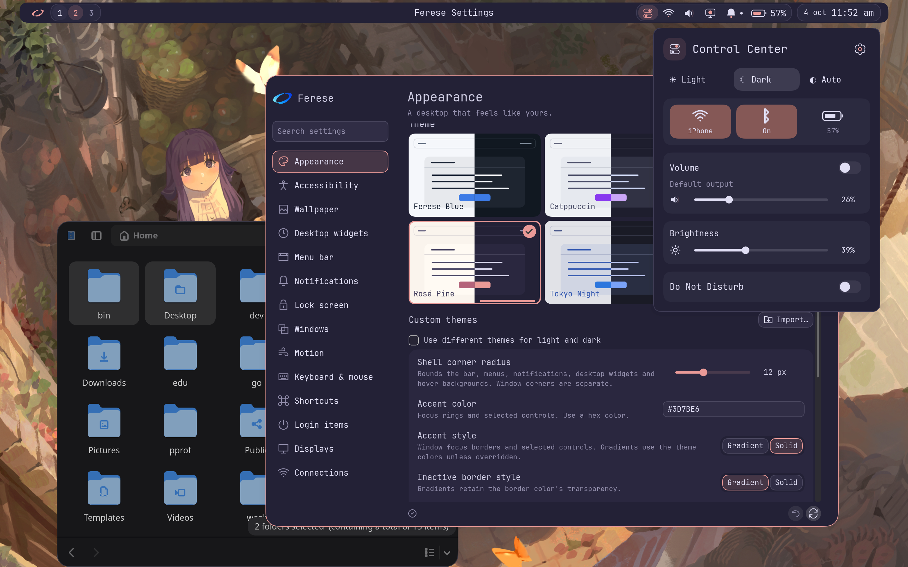

# Why Ferese

Most Wayland desktops are assembled from separate programs: a compositor, a bar, a notification daemon, a launcher and a lock screen, each with its own config and appearance settings. Ferese's window manager and shell share a single configuration.

## Window layouts

Keep windows at useful widths and move through them horizontally with scrolling columns,
divide the screen into nested splits with tree tiling, or let individual windows float
alongside either layout. Overview shows your windows and workspaces together.



## Appearance

Choose a theme in Settings and build on it with your own wallpaper, colors, font,
corners and motion, with changes applying across the desktop as you make them. Window
and shell corners have separate controls, so you can shape each to your liking.



To give your shell corners a different radius, add:

```kdl
theme {
    geometry {
        shell-radius 16
    }
}
```

See [Configuration](configuration.md) for available settings, or follow
[Installation](installation.md) to try Ferese inside your current desktop with a nested
preview.
